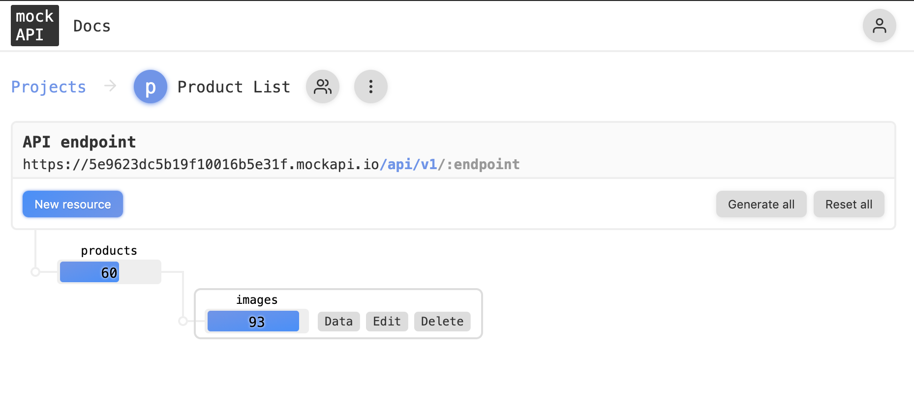
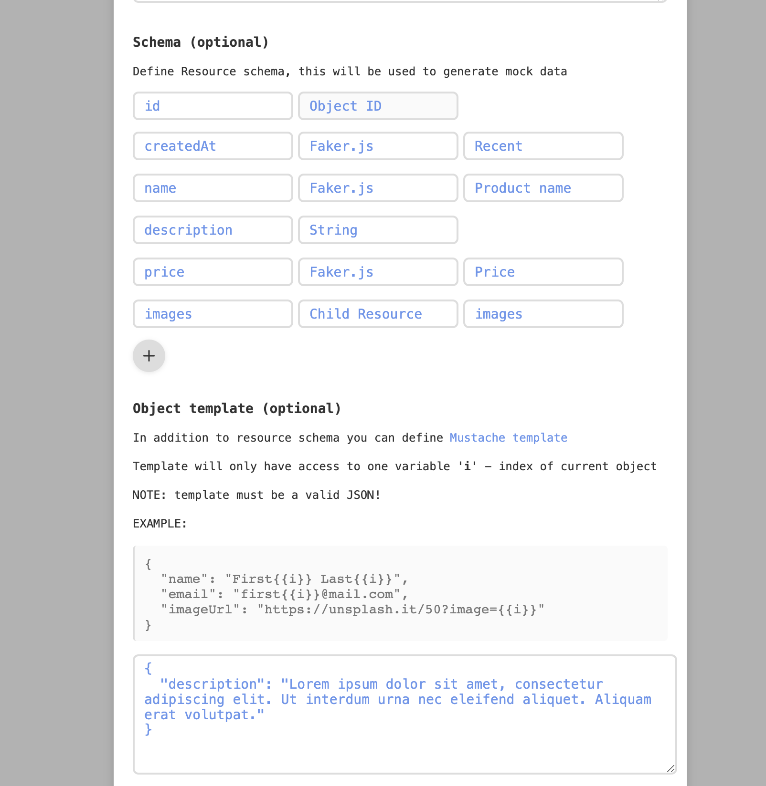
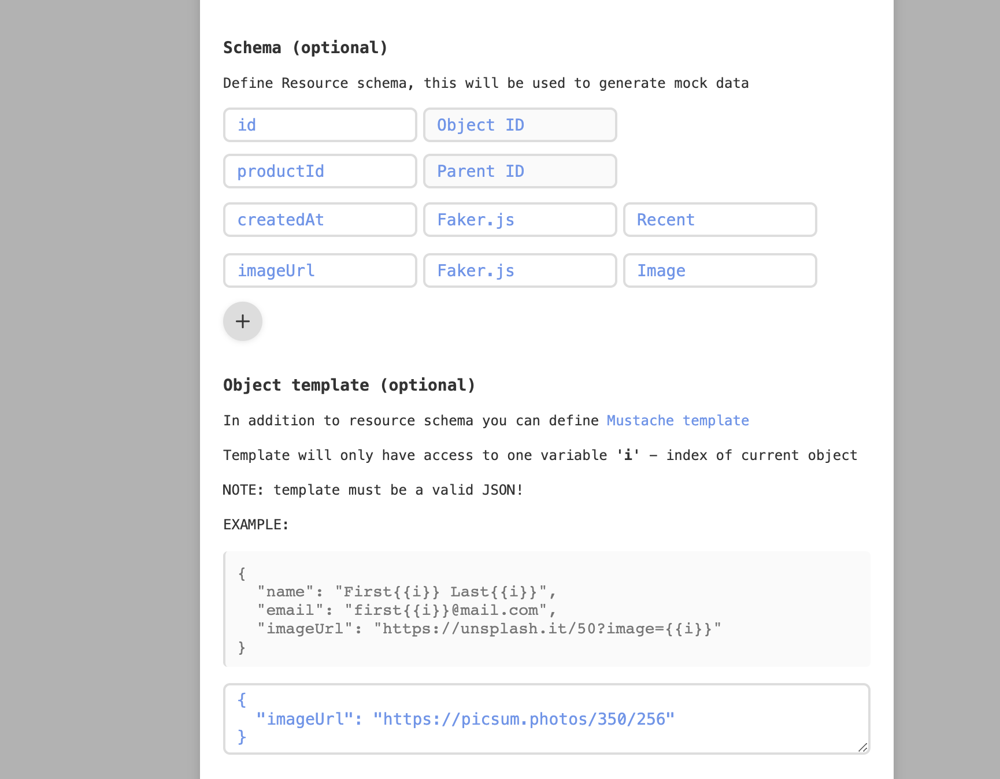

# Set up the API

This project uses a [Mock API](https://mockapi.io/projects) to fake data.

## Here's what the resources look like

**All Resouces**

**The product resource with custom description**

**The image resource with a custom imageUrl**
